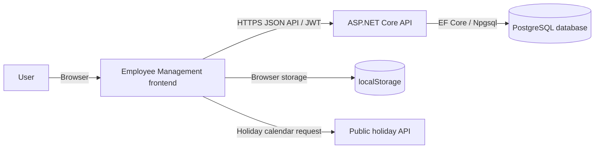
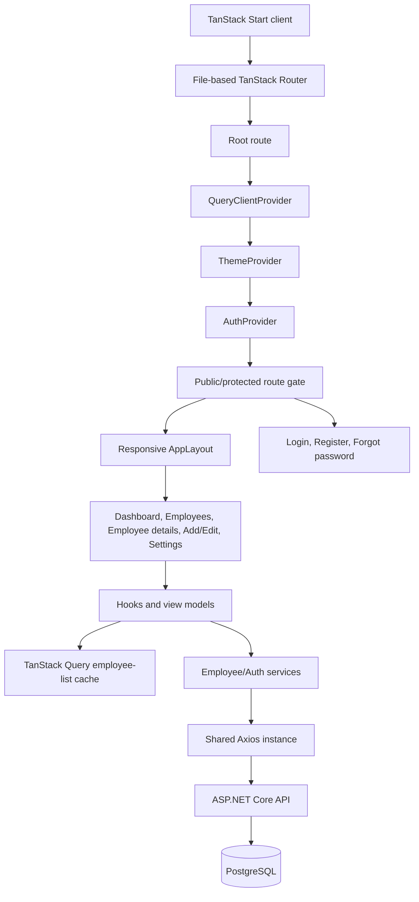
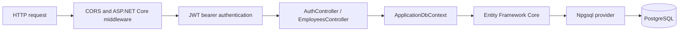
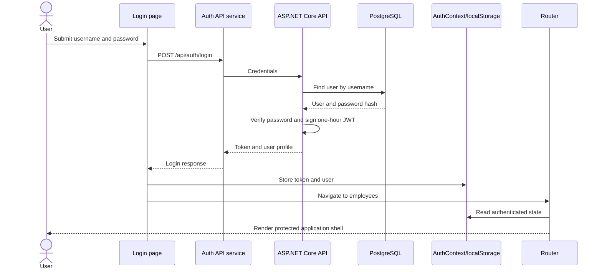
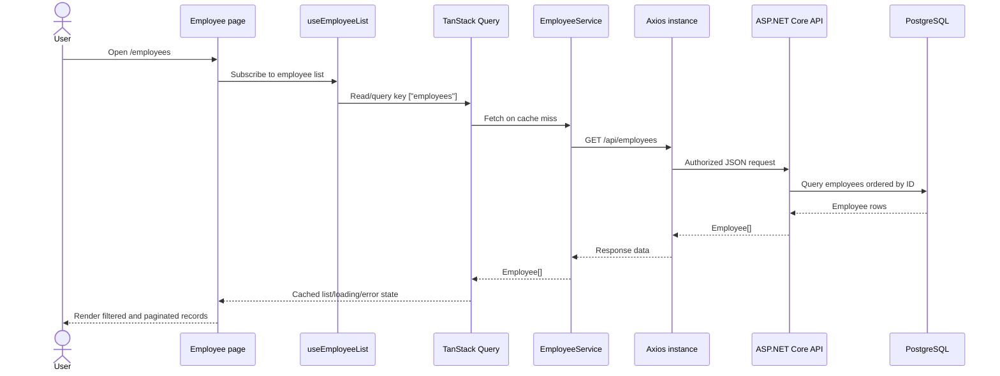

# Run the Project (Windows)

Follow these steps to run the API, PostgreSQL database, and frontend locally. The frontend source is not in this repository, so frontend commands must be run from its own project folder.

## Prerequisites

1. Install the **.NET 10 SDK**. Verify in PowerShell with `dotnet --version`.
2. Install **PostgreSQL** (for example, PostgreSQL 16 or later) and ensure the PostgreSQL service is running. pgAdmin can be used instead of the `psql` command-line tool.
3. Install **Node.js LTS** and npm for the frontend. Verify with `node --version` and `npm --version`.
4. Get the frontend project source; it is not included in this backend repository.

## 1. Create the PostgreSQL database

Using pgAdmin, create a database named `EmployeeDB`. Alternatively, connect to PostgreSQL as an administrator and run:

```sql
CREATE DATABASE "EmployeeDB";
```

The Development configuration expects PostgreSQL on `localhost:5432`. Set the connection string and a private JWT signing key as .NET user secrets rather than committing passwords or keys:

```powershell
Set-Location "D:\Full stack tools\projects\EmployeeMng.API"
dotnet user-secrets init
dotnet user-secrets set "ConnectionStrings:DefaultConnection" "Host=localhost;Port=5432;Database=EmployeeDB;Username=postgres;Password=YOUR_POSTGRES_PASSWORD"
dotnet user-secrets set "Jwt:Key" "REPLACE_WITH_A_PRIVATE_RANDOM_SECRET_AT_LEAST_32_CHARACTERS_LONG"
```

Use the same JWT issuer and audience values configured in `appsettings.json` and `appsettings.Development.json` (`EmployeeMng.API` and `EmployeeMng.Client`).

Apply the checked-in migration to create the `"User"` table. Run this from the API project folder:

```powershell
dotnet ef database update
```

If `dotnet ef` is not installed, install the matching EF Core 10 command-line tool with `dotnet tool install --global dotnet-ef --version 10.0.12`, then run the update command again.

### Important: create the employee table

The checked-in initial migration and `user-table.sql` create only `"User"`, while the EF model snapshot includes `"Employee"`. Therefore, `dotnet ef database update` alone does **not** create the employee table in a fresh database. Before using employee endpoints, either reconcile the migration/snapshot and apply a migration that creates `"Employee"`, or execute this local-development SQL in the `EmployeeDB` database:

```sql
CREATE TABLE IF NOT EXISTS "Employee" (
    "Id" integer GENERATED BY DEFAULT AS IDENTITY PRIMARY KEY,
    "FirstName" text NOT NULL,
    "LastName" text NOT NULL,
    "Email" text NOT NULL,
    "Department" text NOT NULL,
    "Salary" numeric NOT NULL,
    "CreatedDate" timestamp with time zone NOT NULL,
    "IsActive" boolean NOT NULL
);
```

For a maintained deployment, prefer a corrected EF Core migration over manual schema changes and verify that a clean database can be built entirely from migrations.

## 2. Run the backend API

In PowerShell:

```powershell
Set-Location "D:\Full stack tools\projects\EmployeeMng.API"
dotnet restore
dotnet run
```

The Development launch profile serves HTTP at `http://localhost:5000` and HTTPS at `https://localhost:7047`. Use the HTTP URL for the local frontend unless its development setup is configured for the HTTPS certificate. The API routes include the `/api` prefix, for example `http://localhost:5000/api/auth/login` and `http://localhost:5000/api/employees`. OpenAPI is available in Development at `/openapi/v1.json`.

Keep this terminal running while using the frontend.

## 3. Run and connect the frontend

Open a second PowerShell terminal, change to the frontend project folder, then install dependencies and start its development server:

```powershell
Set-Location "PATH\TO\THE\FRONTEND"
npm install
npm run dev
```

If the frontend project uses a different package manager or dev script, use the commands documented by that project. Configure its Vite environment variable to point to the API **including `/api`**, because backend controller routes use that prefix:

```dotenv
VITE_API_BASE_URL=http://localhost:5000/api
```

Put this in the frontend's local environment file (commonly `.env.local`), do not commit secrets there, and restart the frontend dev server after changing it. The frontend service paths should then be `/auth/login`, `/auth/register`, `/auth/forgot-password`, and `/employees` (and employee IDs below `/employees`). If the Axios client already appends `/api`, configure only `http://localhost:5000` instead to avoid a duplicated prefix.

The API currently permits all CORS origins for development. For deployment, restrict CORS to the actual frontend origin. Register a user through the frontend, sign in, then use the protected employee pages; employee operations require the JWT bearer token.

# Employee Management System Design

## 1. Purpose and scope

This document describes the browser-based Employee Management frontend and the ASP.NET Core API and PostgreSQL persistence layer in this repository. The frontend architecture and behavior in this document reflect the application description supplied with this design; backend and database implementation details are based on the source code and migration files in this repository.

## 2. System context



The frontend is responsible for presentation, client-side navigation, form validation, session state, request orchestration, and displaying API results. The API is responsible for authentication, authorization, employee operations, and persistence through Entity Framework Core. PostgreSQL is the relational data store. The API must enforce authorization independently of frontend route and rendering guards.

## 3. Technology and deployment

### Frontend

- React 19 and TypeScript provide the UI and type contracts.
- TanStack Start and TanStack Router provide the application shell and file-based routes.
- TanStack Query caches and deduplicates the employee-list request.
- Axios centralizes API base URL, JSON headers, timeout, and authorization header behavior.
- Tailwind CSS and shared UI components implement the responsive visual system and light/dark themes.
- The API origin is configured through `VITE_API_BASE_URL`.

### Backend and database

- ASP.NET Core on .NET 10 exposes controller-based JSON endpoints.
- Entity Framework Core 10 with the Npgsql provider connects the API to PostgreSQL.
- ASP.NET Core JWT bearer authentication validates signed access tokens.
- BCrypt.Net-Next hashes and verifies account passwords.
- OpenAPI is mapped in Development only.
- The API Dockerfile publishes a .NET 10 application and listens on port `10000`.
- The API reads `ConnectionStrings:DefaultConnection` and `Jwt:Key`, `Jwt:Issuer`, and `Jwt:Audience` from configuration. Supply deployment-specific values through a secure configuration mechanism; do not commit credentials or signing keys.
- The frontend and API are separately hosted. The browser must be able to reach the API, and the API CORS policy must allow the deployed frontend origin.

## 4. Frontend architecture



The root component hosts the query, theme, and authentication providers. The shared application shell supplies the responsive sidebar, header, theme control, and logout action for application pages. Login, registration, and forgot-password render outside that shell.

### Frontend route groups

| Route | Access | Responsibility |
|---|---|---|
| `/login` | Public | Sign in and establish the client session |
| `/register` | Public | Create an account |
| `/forgot-password` | Public | Request password recovery |
| `/` | Authenticated | Workforce dashboard |
| `/employees` | Authenticated | Search, filter, paginate, create, and delete employee records |
| `/employees/new` | Authenticated | Create an employee |
| `/employees/$id` | Authenticated | View one employee |
| `/employees/$id/edit` | Authenticated | Update an employee |
| `/settings` | Authenticated | UI preferences and settings content |

The frontend route gate redirects signed-out users to `/login`. It is a navigation and rendering safeguard only; the API must authorize every protected request independently.

## 5. Backend architecture and API



`Program.cs` registers controllers, `ApplicationDbContext`, PostgreSQL, JWT bearer authentication, and the `AllowFrontend` CORS policy. Authentication runs before authorization and controller endpoint mapping. Employee endpoints require an authenticated bearer token. Login, registration, and password-recovery endpoints are public.

The current CORS policy allows any origin, header, and method. Restrict allowed origins and methods to the deployed frontend and required operations before production deployment. JWT issuer, audience, signing key, and expiry must be configured consistently between issuance and validation.

### API endpoints

Controller routes use the `/api/[controller]` prefix. Therefore the backend paths include `/api`; ensure the frontend's configured base URL or service paths account for that prefix.

| Method | Backend path | Access | Behavior |
|---|---|---|---|
| `POST` | `/api/auth/register` | Public | Creates a user with a BCrypt password hash and the default `User` role; returns account profile fields |
| `POST` | `/api/auth/login` | Public | Verifies username/password and returns a one-hour JWT and user profile |
| `POST` | `/api/auth/forgot-password` | Public | Returns a generic success message |
| `GET` | `/api/employees` | JWT required | Returns employees ordered by ID |
| `GET` | `/api/employees/{id}` | JWT required | Returns one employee or `404` |
| `POST` | `/api/employees` | JWT required | Creates an employee and returns `201 Created` |
| `PUT` | `/api/employees/{id}` | JWT required | Updates first name, last name, email, department, and salary; returns `404` if missing |
| `DELETE` | `/api/employees/{id}` | JWT required | Deletes an employee and returns `204`; returns `404` if missing |

The forgot-password handler currently does not create a reset token or send email. Registration checks for existing username/email in application code, returns `400` on a duplicate, and does not issue a token. Database-level unique constraints are not present in the current model/migration.

### Authentication and session flow



The access token and user profile are stored in browser `localStorage` under `auth_token` and `auth_user`. The frontend Axios request interceptor reads `auth_token` and adds it as a bearer authorization header when present. Logout clears both values and returns the user to the login page.

The API signs JWTs with HMAC-SHA256, includes user ID, username, email, and role claims, and sets a one-hour expiry. JWT bearer validation checks the signing key, issuer, audience, and lifetime. The API applies a zero clock-skew allowance. The current employee controller requires authentication but does not apply role-specific policies or per-user ownership checks.

Because `localStorage` is accessible to JavaScript running on the origin, it is a client-side persistence choice rather than a high-assurance session boundary. Production security depends on HTTPS, appropriate token lifetime/revocation, API-side authorization, and protection against script injection. An HTTP-only, Secure, SameSite cookie-backed session is a possible future alternative if supported by the API.

### Employee data flow



The shared list query is used by the employee list, dashboard, and add-employee department picker. A common query key lets those subscribers share cached data and an in-flight request. Explicit refresh, and mutation completion followed by refresh, initiate a new read.

The employee details hook currently performs its own GET by ID. Employee create, update, and delete operations are exposed through the employee service/API wrappers. The UI performs filtering and pagination on the fetched list.

## 6. Database design and current schema status

The API uses PostgreSQL through Npgsql. `ApplicationDbContext` exposes `Users` and `Employees` sets and maps the corresponding entities to tables named `"User"` and `"Employee"`. No relationships are configured between users and employees.

### User table

The checked-in SQL export and initial migration create this table:

| Column | PostgreSQL type | Nullable | Description |
|---|---|---:|---|
| `Id` | `integer` identity | No | Primary key |
| `Username` | `text` | No | Login name |
| `Email` | `text` | No | Account email |
| `PasswordHash` | `text` | No | BCrypt password hash; never store the plain-text password |
| `Role` | `text` | No | Role claim source; registration currently assigns `User` |

The SQL also maintains the EF `__EFMigrationsHistory` table. The current schema has no database unique index or constraint on username or email, so application-level duplicate checks alone do not guarantee uniqueness under concurrent registrations.

### Employee model

The EF model snapshot describes the following employee table shape:

| Column | PostgreSQL type | Nullable | Description |
|---|---|---:|---|
| `Id` | `integer` identity | No | Primary key |
| `FirstName` | `text` | No | Employee first name |
| `LastName` | `text` | No | Employee last name |
| `Email` | `text` | No | Employee email |
| `Department` | `text` | No | Department name |
| `Salary` | `numeric` | No | Salary amount |
| `CreatedDate` | `timestamp with time zone` | No | Employee creation date |
| `IsActive` | `boolean` | No | Active status |

The migration history and exported SQL currently do **not** create `"Employee"`: the checked-in `InitialCreate` migration creates only `"User"`, even though the EF model snapshot and `ApplicationDbContext` include employees. Employee CRUD therefore depends on the employee table being provisioned by another schema change or database process not evidenced here. Add and apply an EF migration that creates `"Employee"` (and any desired constraints/indexes) before relying on these endpoints in a fresh database.

## 7. Client state ownership

| State | Owner | Persistence |
|---|---|---|
| Employee list and request status | TanStack Query via `useEmployeeList` | In-memory query cache |
| Single employee detail and request status | `useEmployee` hook | Component/hook state |
| Authenticated token and user | `AuthContext` | `localStorage` plus React state |
| Theme selection | `ThemeContext` | `localStorage` plus document class |
| Search, department/status filters, pagination, dialog state | Employees page | Component state |
| Form values and validation feedback | Individual form/page | Component state |
| Users and employees | PostgreSQL via `ApplicationDbContext` | Persistent database |

## 8. Error handling and observability

- Axios network and timeout failures receive a user-readable API connectivity message.
- API status `404` and `500` are mapped to user-facing messages.
- List pages render loading, empty, and retryable error states.
- Mutations surface success/failure notifications.
- The TanStack root error boundary reports unexpected rendering/navigation errors and offers retry/home actions.
- The API uses standard HTTP responses for invalid credentials (`401`), duplicate registration (`400`), missing employee records (`404`), successful creation (`201`), and successful deletion (`204`).
- The API does not currently document centralized exception handling, structured logging, health checks, or database telemetry in the verified implementation.
- The frontend root-level navigation guard is not an API security mechanism.

## 9. Quality attributes

- **Responsive UX:** shared shell adapts to mobile and desktop navigation layouts.
- **Request efficiency:** list requests use a shared query cache and query key.
- **Maintainability:** frontend pages, components, hooks, API wrappers, and types have distinct responsibilities; backend controllers, models, and EF data access are separated.
- **Configuration:** frontend API origin, database connection, and JWT validation/issuance settings are external configuration.
- **Availability:** employee operations require the API and PostgreSQL database to be reachable.
- **Security boundary:** authentication and authorization must be enforced by the API, even when the frontend hides or redirects protected routes.
- **Persistence:** PostgreSQL stores account and employee records; EF Core migrations are the schema evolution mechanism.

## 10. Constraints and follow-up design considerations

1. Add and apply a migration for the `Employee` table; verify a clean database can be created from migrations.
2. Add database unique constraints/indexes for normalized username and email if they must be unique, and align registration handling with database conflicts.
3. Ensure the API validates authorization and ownership on every employee endpoint; client route protection can be bypassed.
4. Restrict the current permissive CORS policy to the deployed frontend origin.
5. Define and document token expiry, refresh, invalid-token handling, and logout/revocation behavior with the frontend.
6. Implement the password-reset token lifecycle and delivery, or keep the endpoint explicitly documented as a placeholder.
7. Confirm the frontend's API base URL includes the backend `/api` route prefix.
8. Define whether department values and employee status are backend-managed reference data or frontend constants.
9. Confirm the API contract for employee creation/update, missing-record and validation responses, and setting `CreatedDate`/`IsActive`.
10. Add automated tests for auth persistence/redirects, list-query deduplication, CRUD request behavior, API error states, authorization, and schema migrations.
